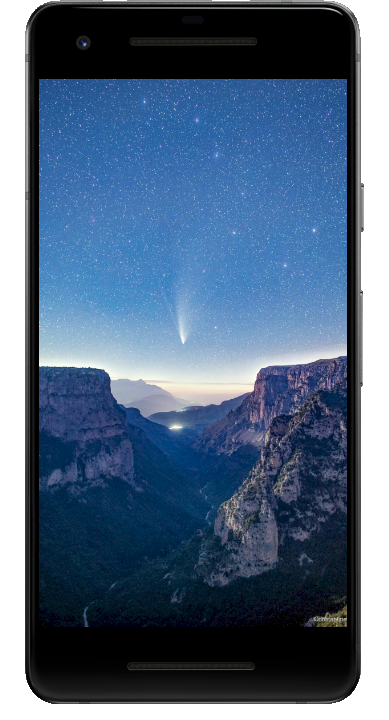
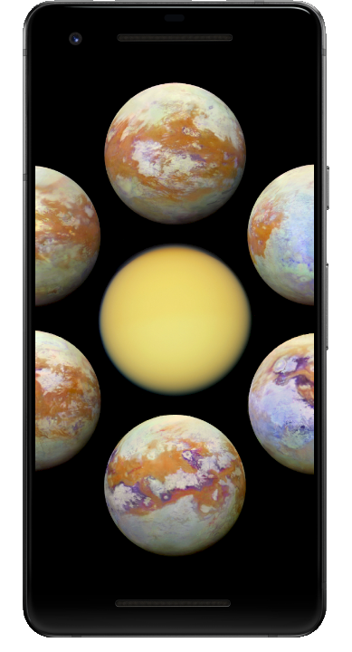
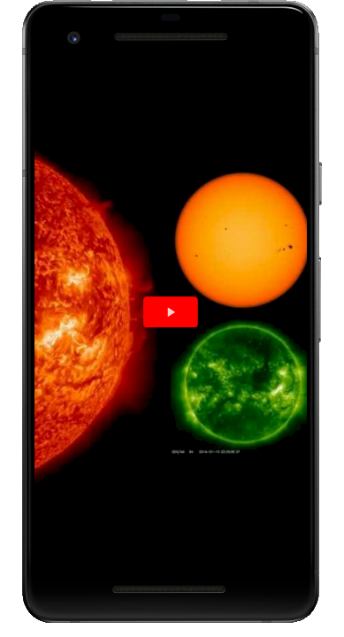
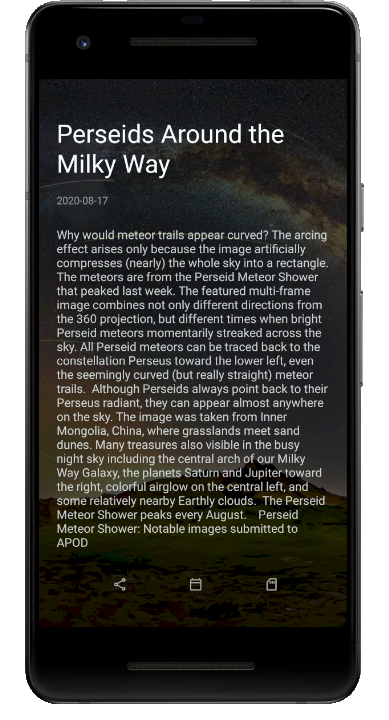
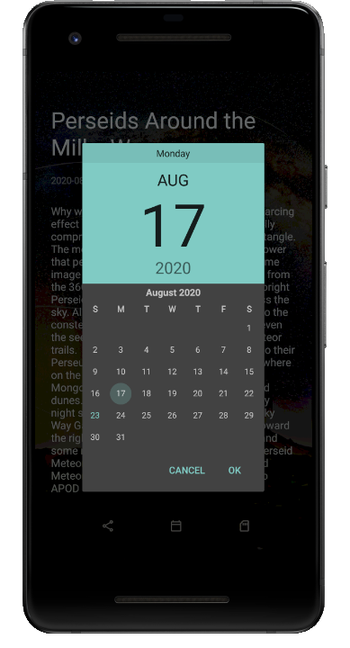
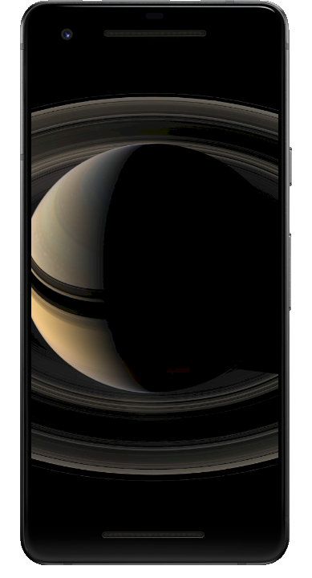

# APoD

Shows NASA's Astronomy Picture of the Day

Web https://apod.nasa.gov/apod

API https://api.nasa.gov/

Use Android Compose

--------------------------

Day Picture screen
<ul>
    <li>shows the latest one picture</li>
    <li>allows to select specific calendar day</li>
    <li>let you to navigate previous / next picture</li>
    <li>let to save picture to external storage</li>
    <li>get picture description</li>
    <li>let sharing a picture link</li>
    <li>supports media types YouTube and Image</li>
</ul>

## Screenshots

 
 
 

© iMax (Maxeem) Shemetov, 2020
